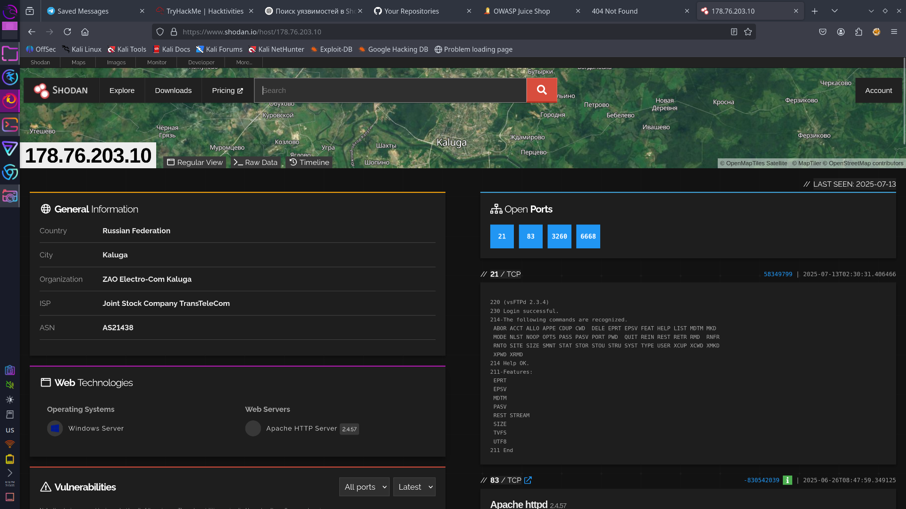
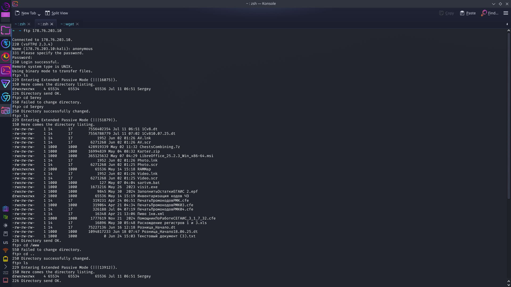
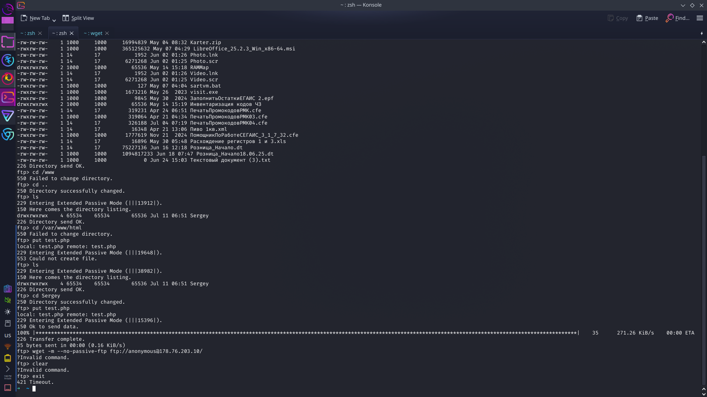
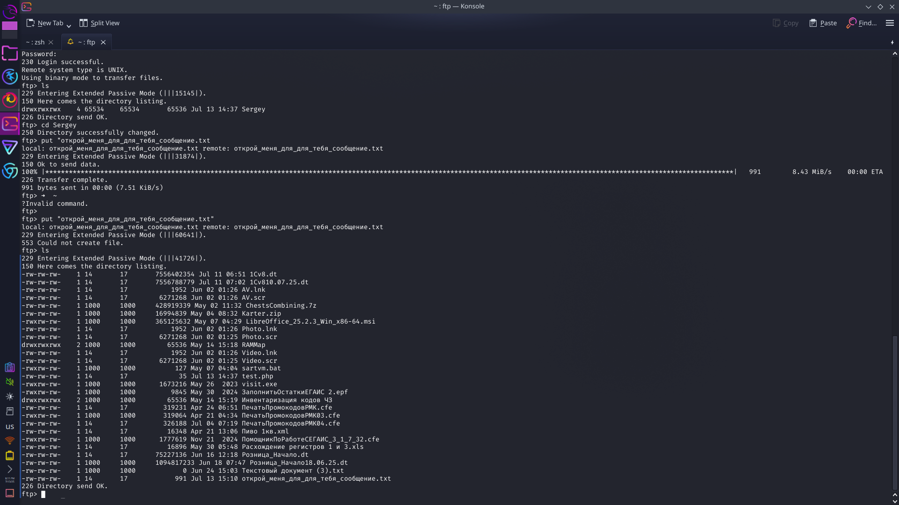

# i-hacked-russian-ftp-server
это я с тикток

## как всё началось  
ну типо сидел, нечего делать было, зашёл в shodan, искал какие-нибудь уязвимые серваки  
просто поигратся, потестить metasploit, потренироваться  
и наткнулся на один сервер, там ftp открыт вообще без пароля

закинул скрин —   
оказалось, что там стоит vsftpd 2.3.4, с уязвимостью бэкдор  
хотел зайти через бэкдор, но он не сработал, и я пошёл смотреть ftp

---

## как зашёл  
вообще без легко, просто anonymous логин, и ты уже внутри  
вот скрины —    и 
посмотрел, полазил, ничего не мешает — качай, заливай, удаляй, живи

---

## чо там внутри  
ну я бы сказал — алкобизнес  
файлы всякие: про водку, пиво, поставщиков, какие-то .dt и .cfe 1С, скрипты, .exe, даже .scr  
короче, важные файлы

я даже подумал сервер свой запустить, но веб и фтп там разделены, так что не получилось

---

## сообщение им  
решил быть человеком, не стал удалять ничего  
написал им сообщение, типа:  
йоу у вас там все откыто можно хоть жить там

скрин — 

ну по-честному, я сначала хотел снести всё, но потом подумал — а смысл 

---

## вывод  
всё было открыто, можно было взять, что хочешь  
никто бы даже не заметил  
а ведь там файлы, базы, бухучёт

не удалял ничего, просто посмотрел и ушёл  

